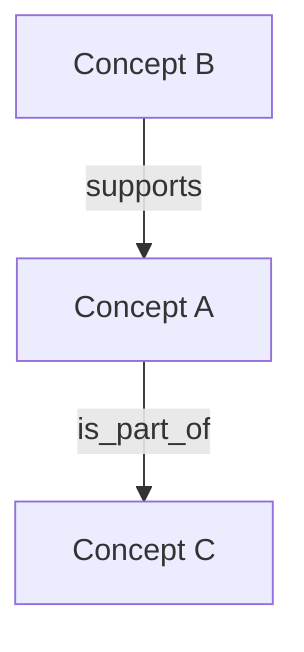

# Knowledge Graph: Topic Name

## Overview

Brief 2-3 sentence summary of what this knowledge graph covers and its scope.

## Nodes

### Category 1
- [[node_001_concept_a]] - Short description
- [[node_002_concept_b]] - Short description

### Category 2
- [[node_003_concept_c]] - Short description

## Statistics

- Total nodes: 0
- Total unique references: 0
- Evaluation: 0 passed, 0 failed

## Graph Structure

